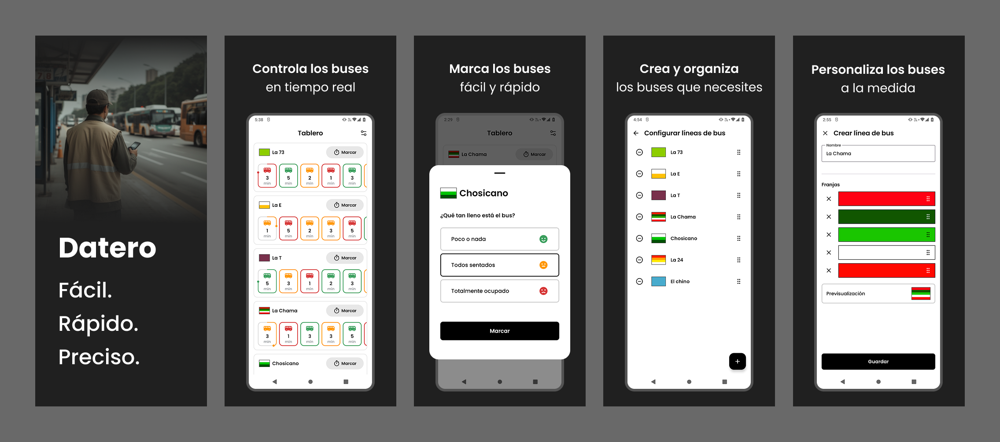

  

<h1 align="center">🚍 Datero: controla los buses en tiempo real</h1>

  Tu herramienta confiable, moderna y hecha a tu medida.

---

## 🚌 ¿Qué es Datero?

**Datero** es una app diseñada para ayudarte a monitorear y registrar el tiempo de los buses de manera ágil, precisa y sin complicaciones.  
Olvídate del papel y del reloj: **convierte tu celular en tu mejor herramienta de trabajo.**

---

## 🧩 Funciones clave

### 🕒 Monitoreo en tiempo real  
Controla cuánto tiempo ha pasado desde el último bus en tiempo real.

### ⚡ Marcado ultra rápido 
Rápido y sin distracciones. Olvidate de sumar y restar tiempos. Con un toque registras la llegada del bus. Simple y eficaz.

### 🎨 Visualización clara y personalizable  
Asigna nombre y franjas de color a cada línea. Identifícalas al instante con solo mirar.

### 🧠 Organización inteligente  
Ordena los buses como prefieras. Todo adaptado a tu forma de trabajar.

---

## 🧭 ¿Por qué elegir Datero?

Porque no es una app genérica.  
Datero está diseñada con un enfoque realista, para quienes necesitan agilidad, claridad y eficiencia durante su jornada:

✔️ Ligera y rápida  
✔️ Fácil de usar  
✔️ Sin complicaciones  
✔️ Hecha para el trabajo en campo  
✔️ Optimizada para el día a día

---

## 🖼️ Vista general

  

---

## 🛠️ Tecnologías

- ⚙️ **Kotlin** + **Jetpack Compose**
- 🧱 **Clean Architecture** + MVI
- 🔄 **Kotlin Coroutines** + **Flow**
- 🗂️ **Room Database**
- ☁️ **Firebase** (Crashlytics)
- 🌐 **Huawei Mobile Services** (Crash)
- ⚙️ **Gradle Kotlin DSL**

---

## 📩 ¿Tienes dudas o sugerencias?

Contáctame:  
📧 **alexandre.castillo.labs@gmail.com**

---

## 📝 Licencia

MIT © [Alexandre Castillo](https://github.com/alexandrecastillo)
